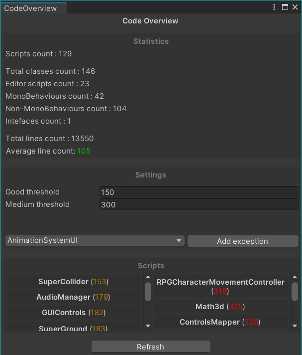

# Code Overview

_This tool is a Unity editor tool._

Code Overview is a Unity editor tool to help you keep an eye on code quality.

## Usage

In the Unity Editor, in the top menu bar, under the "Tools" tab you'll find an "CodeOverview" option.
This will open the Instant Doc editor window.

This editor window is split into three regions :

- **Statistics** : Aggregate informations about your codebase.
- **Settings** : Tool settings and excluded classes.
- **Scripts** : List of long scripts.

### Statistics

This tool detects C# scripts in your project, analyzes them and counts code lines (non-empty and non-comment lines) in each script.\
You then get aggregate statistics for :

- Script count.
- Total classes.
- Editor, MonoBehaviour, Non-MonoBehaviour and Interfaces count.
- Total lines count.
- Average line count.

The average line count will be colored depending on the thresholds defined on the "settings" section of the tool.

### Settings

The thresholds are used to determine if a script has too many usefull lines of code.\
If the script has more usefull lines than the thresholds defined here it will be displayed in the "Scripts" section below.

You can also define a list of scripts to exclude from the analysis (for example scripts included with asset packs) and manage this list.\
These scripts will not be counted for statistics and will not show up in the section below.

Both the thresholds and the excluded script list are saved to a json text file called "**CodeOverviewConfig.json**" in the same directory as the tool's script.\
This enables you to share the configuration accross multiple users.

### Scripts

This sections contains two lists of scripts for "medium scripts" where the scripts contain more usefull lines than the _good threshold_ but less than the _medium threshold_; and the "bad scripts" where the scripts contain more usefull lines than the _medium threshold_.

**Medium scripts** are displayed on the left with their line count in orange.\
**Bad scripts** are displayed on the right with their line count in red.

The _refresh button_ is used to refresh the list of detected scripts in case you reloaded assemblies since you opened this editor window.

## Support

This tool supports all C# scripts.